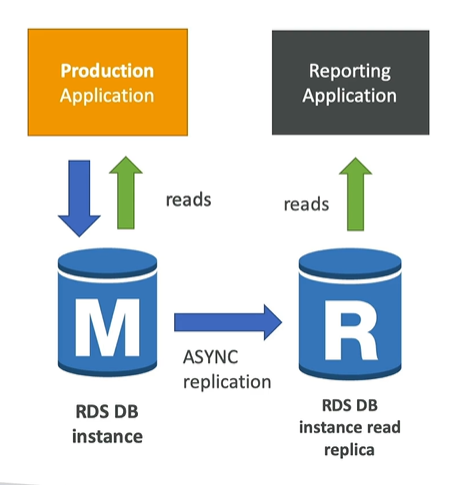

# Amazon RDS

- RDS stands for Relational database service
- It’s a managed DB service for DB that use SQL as a query language.
- It allows you to create databases in the cloud that are managed by AWS Eg.
  • Postgres
  • MySQL
  • MariaDB
  • Oracle
  • Microsoft SQL Server
  • IBM DB2
  • Aurora (AWS Proprietary database)

### Advantage over using RDS versus deploying DB on EC2

- **Continuous backups and restore to specific timestamp** (Point in Time Restore)!
- Monitoring dashboards
- **Read replicas for improved read performance**
- Multi AZ setup for DR (Disaster Recovery)
- Maintenance windows for upgrades
- Scaling capability (vertical and horizontal)
- Storage backed by EBS
- But you cannot SSH into instance

NOTE:- **_Read replicas uses async replication and Multi-AZ uses synchronous replication._**

### RDS – Storage Auto Scaling

- Helps you increase storage on your RDS DB instance
  dynamically
- **When RDS detects you are running out of free database
  storage, it scales automatically**
- Avoid manually scaling your database storage
- You have to set Maximum Storage Threshold (maximum limit for DB storage)
- Automatically modify storage if:
    - Free storage is less than 10% of allocated storage
    - Low-storage lasts at least 5 minutes
    - 6 hours have passed since last modification

### RDS Read Replicas for read scalability

- Up to 15 Read Replicas
- Within AZ, Cross AZ or Cross Region
- Replication is ASYNC, so reads are eventually consistent
- Replicas can be promoted to their own DB
- Applications must update the connection string to leverage read replicas
- **Read replicas are used for SELECT (=read) only kind of statements (not INSERT, UPDATE, DELETE)**

**RDS Read Replicas Network Cost**

- In AWS there’s a network cost when data goes from one AZ to another
- For RDS Read Replicas within the same region, you don’t pay that fee



### RDS Multi AZ (Disaster Recovery)

- you **create SYNC replication with different AZ RDS replicas**
- One DNS name – automatic app failover to standby
- Failover in case of loss of AZ, loss of
  network, instance or storage failure **( means standby instance became master on master failure )**
- _What happens internally when you go From Single-AZ to Multi-AZ_
    1. A snapshot is taken
    2. A new DB is restored from the snapshot in a new AZ
    3. Synchronization is established between the two databases

### Hands on - RDS

```txt
1. Go to Aurora and RDS
2. select full configuration
3. select engine type (postgres, mysql, mariadb, oracle, microsoft sql server, ibm db2, aurora (aws proprietary database))
4. select db engine (postgres, mysql, mariadb, oracle, microsoft sql server, ibm db2, aurora (aws proprietary database))
5. select version
6. Select template
   - Production
   - Dev/Test
   - Free Tier
7.credentials settings
   - DB instance identifier
   - Master username
   - Master password
   - Confirm password
8. DB instance configuration
   - Select instqnce type
9. storage
   - storage type
   - storage allocation in gb
   - additional storage auto scaling ( enable / disable )
10. Connectivity
   - Compute resource
   - VPC
   - Public access
   - VPC security group
11. Additional configuration
    - Database port
    - Database name
    - Enable deletion protection

Create Read Replicas
1. Click on actions -> create read replica

Monitoring: GO to DB instance --> monitoring --> You can watch logs

Backup: It take automated backups

Snapshots: Using Snapshots you can take database backup and using it you can restore DB if DB is deleted.
```

# Amazon Aurora

- It is an **AWS proprietary database** ( it is not open source like postgres or mysql )
- Postgres and MySQL are both supported as Aurora DB (that means your drivers will work as if Aurora was a Postgres or MySQL database)
- Aurora is “AWS cloud optimized” and **claims 5x performance improvement over MySQL on RDS, over 3x the performance of Postgres on RDS**
- Aurora can have up to 15 replicas and the replication process is faster than MySQL (sub 10 ms replica lag)
- Failover in Aurora is instantaneous. It’s HA (High Availability) native.
- Aurora **costs more than RDS (20% more)** – but is more efficient

### Aurora High Availability and Read Scaling

- 6 copies of your data across 3 AZ:
    - 4 copies out of 6 needed for writes
    - 3 copies out of 6 need for reads
    - Self healing with peer-to-peer replication
    - Storage is striped across 100s of volumes
- One Aurora Instance takes writes (master)
- Automated failover for master in less than 30 seconds
- Master + up to 15 Aurora Read Replicas serve reads

## RDS & Aurora Security

- **At-rest encryption**
    - Database master & replicas encryption using AWS KMS – must be defined as launch time
    - If the master is not encrypted, the read replicas cannot be encrypted
    - To encrypt an un-encrypted database, go through a DB snapshot & restore as encrypted
- **In-flight encryption**: TLS-ready by default, use the AWS TLS root certificates client-side
- **IAM Authentication**: IAM roles to connect to your database (instead of username/pw)
- Security Groups: Control Network access to your RDS / Aurora DB
- No SSH available except on RDS Custom
- Audit Logs can be enabled and sent to CloudWatch Logs for longer retention

## Amazon RDS Proxy

Amazon RDS Proxy is a fully managed, highly available database proxy that **sits between your application and your RDS database** (Aurora, MySQL, PostgreSQL, MariaDB, SQL Server). It handles connection pooling, sharing, and management, allowing applications to scale without overwhelming database resources

Improving database efficiency by reducing the stress
on database resources (e.g., CPU, RAM) and minimize
open connections (and timeouts)

RDS Proxy is never publicly accessible (must be
accessed from VPC)

### The Problem It Solves:

1. Connection Overload: **Each application instance opens many connections to the database, consuming memory and CPU on the database server**

## Amazon ElastiCache Overview

- ElastiCache is to get managed Redis or Memcached
- Caches are in-memory databases with really high performance, low latency
- Helps reduce load off of databases for read intensive workloads
- AWS takes care of OS maintenance / patching, optimizations, setup,
  configuration, monitoring, failure recovery and backups

The Problem It Solves:
`Traditional applications store data in disk-based databases (like Amazon RDS), which have higher latency due to disk I/O operations. Reading data from disk is significantly slower than reading from memory.`

### Elastic Cache Hands on

```txt
1. Go to Elastic Cache from search
2. Select configuration - valkey, memchached(inmemory), Redis
3. Select deployment option - serverless, node-based(Requires manual configuration)
4. Select location - aws cloud, on premises
5. Multi AZ
6. Cache settings
   -Engin version
   - Node type ( size )
   - No. of replicas(scaling purpose)
7. Subnet Group
8. Security Groups
9. review and save
```
