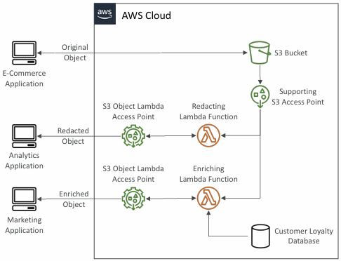

# Amazon S3

### Use cases

- Backup and storage
- Disaster Recovery
- Archive
- Hybrid Cloud storage
- Application hosting
- Media hosting
- Data lakes & big data analytics
- Software delivery
- Static website

## Buckets

1. Amazon S3 allows people to store objects (files) in “buckets” (directories)
2. Buckets are defined at the region level

## Objects

- Objects (files) have a Key
- The key is the FULL path: s3://my-bucket/my_folder1/another_folder/my_file.txt
- The key is composed of **prefix** + _object name_ : s3://my-bucket/**my_folder1/another_folder**/_my_file.txt_
- Object values are the content of the body:
    - Max. Object Size is 50TB (50,000GB)
    - If uploading more than 5GB, must use “multi-part upload”
- Version ID (if versioning is enabled)

### Hands on

```txt
1. General configuration
    - bucket type
    - bucket namespace - global, account regional

    - You can also choose existing bucket conf also
2. Owner ship
    -ACL is disabled ( all objects own by you)
    -ACL is enabled ( object own by aws )
3. Public access setting
4. Bucket Versioning
```

### Note:- If public access is disabled and you have presigned URL(Object URL) then you can access image with presigned url, but you can not access image with public URL.

## Amazon S3 – Security

1. User-Based
    - IAM Policies – which API calls should be allowed for a specific user from IAM

2. Resource-Based
    - Bucket Policies – bucket wide rules from the S3 console - allows cross account
    - Object Access Control List (ACL) – finer grain (can be disabled)
    - Bucket Access Control List (ACL) – less common (can be disabled)
3. Note: an IAM principal can access an S3 object if
    - The user IAM permissions ALLOW it OR
    - AND there’s no explicit DENY the resource policy ALLOWS it
4. Encryption: encrypt objects in Amazon S3 using encryption keys

### S3 Bucket Policies

1. JSON based
    - Resources: Bucket and objects Eg. "Resource": "arn:aws:s3:::amzn-s3-demo-bucket/\*"
    - Effect: Allow or Deny
    - Action: Set of API to allow or deny Eg. "s3:GetObject"
    - Principle: The **account or user to apply policy to**

    ie. above policy means anyone can **read all object** from **arn:aws:s3:::amzn-s3-demo-bucket**

    eg.

    ```json
    {
        "Version": "2012-10-17",
        "Statement": [
            {
                "Effect": "Allow",
                "Principal": "*",
                "Action": "s3:GetObject",
                "Resource": "arn:aws:s3:::amzn-s3-demo-bucket/*"
            }
        ]
    }
    ```

- **for Cross Account access ie. from another account user can access your S3 bucket, then you have to use Bucket policy**

### S3 Static website hosting

- S3 can host static websites and have them accessible via internet.
- If you get a **403 Forbidden** error, make sure the bucket policy allows public reads!

- to enable it go to
    - properties
    - Static website hosting
    - enable
    - upload index.html and error.html
    - save changes

### Versioning

- It is enabled at the bucket level
- Same key overwrite will change the “version”: 1, 2, 3…
- t is best practice to version your buckets
    - Protect against unintended deletes (ability to restore a version)
    - Easy roll back to previous version

**NOTE: If you have versioning enabled and you _deleted any file then it does not delete file, but it will create a delete marker_, so that file is not accessible by public but still present in S3** and if **you permanently delete that delete marker** then that file will get **restore and you can access it again**

### S3 Replication

- CRR - Cross Region Replication
- SRR - Same Region Replication

1. Must enable Versioning in source and destination buckets
2. Buckets can be in different AWS accounts
3. Copying is asynchronous
4. Must give proper IAM permissions to S3
5. Use cases:
    - CRR – compliance, lower latency access, replication across accounts
    - SRR – log aggregation, live replication between production and test accounts
6. After **you enable Replication, only new objects are replicated**
7. Optionally, **you can replicate existing objects using S3 Batch Replication**
    - Replicates existing objects and objects that failed replication
8. For DELETE operations
    - Can replicate delete markers from source to target (optional setting)
    - Deletions with a version ID are not replicated (to avoid malicious deletes)

#### How to create replication rule in S3?

```txt
1. Select source bucket
2. Go to Management tab
3. Click on "Replication rules" → "Create replication rule"
4. Choose rule scope - apply all OR specific object
5. Select destination bucket (and region if cross-region)
6. Additional replication option
    - If you want delete markers also replicated then check **Delete Markers** ( This will also replicate delete markers but not deleted version files)
7. Save rule
```

### S3 Storage Classes

1. **General Purpose**

- 99.99% Availability
- Used for frequently accessed data
- Low latency and high throughput
- Sustain 2 concurrent facility failures

2. **Infrequent Access**

- For **data that is less frequently accessed, but requires rapid access when needed**
    - Lower cost than S3 Standard
    - Amazon S3 Standard-Infrequent Access (S3 Standard-IA)
    - 99.9% Availability
    - Use cases: Disaster Recovery, backups
- Amazon S3 One Zone-Infrequent Access (S3 One Zone-IA)
    - High durability (99.999999999%) in a single AZ; lost when AZ is destroyed
    - 99.5% Availability
    - Use Cases: Storing secondary backup on-premises data, or data you can recreate

3. **Amazon S3 Glacier Storage Classes**

- Low-cost object storage **meant for archiving / backup**
- Pricing: price for storage + object retrieval cost
- Amazon S3 Glacier Instant Retrieval
    - **Millisecond retrieval**, great for **data accessed once a quarter**
    - **Minimum storage duration of 90 days**
- Amazon S3 Glacier Flexible Retrieval (formerly Amazon S3 Glacier):
    - Expedited (1 to 5 minutes), Standard (3 to 5 hours), Bulk (5 to 12 hours) – free
    - Minimum storage duration of 90 days
- Amazon S3 Glacier Deep Archive – for long term storage:
    - Standard (12 hours), Bulk (48 hours)
    - Minimum storage duration of 180 days


### Hands on

```txt
1. Create bucket
2. Upload file
3. select file
5. go to permissions in upload file tab

You will see different storage classes with there properties
```

## Amazon S3 – Lifecycle Rules

1. **Transition Actions** – configure objects to transition to another storage class
    - Move objects to Standard IA class 60 days after creation
    - Move to Glacier for archiving after 6 months
2. **Expiration actions** – configure objects to expire (delete) after some time
    - Access log files can be set to delete after a 365 days
    - Can be used to delete old versions of files (if versioning is enabled)
    - Can be used to delete incomplete Multi-Part uploads
3. **Rules can be created for a certain prefix** (example: s3://mybucket/mp3/\*)
4. **Rules can be created for certain objects Tags** (example: Department: Finance)

## Lifecycle Rules (Scenario)

**Que:-** Your application on EC2 creates images thumbnails afterprofile photos are uploaded to Amazon S3. These thumbnails can be easily recreated, and only need to be kept for 60 days. The source images should be able to be immediately retrieved for these 60 days, and afterwards, the user can wait up to 6 hours. How would you design this?

**Ans:**-

- S3 source images can be on **Standard**, with a lifecycle configuration to **transition them to Glacier after 60 days**
- S3 thumbnails can be on **One-Zone IA**, with a lifecycle configuration to **expire them (delete them) after 60 days**

## Amazon S3 Events

S3 can send notifications to **SQS, SNS, Lambda** when specific events occur in the bucket

- Object name filtering possible (\*.jpg)
- Use case:
    - generate thumbnails of images uploaded to S3
- Can create as many “S3 events” as desired
- S3 event notifications typically deliver events in seconds but can sometimes take a minute or longer

**Note:**- TO Allow S3 to send message you have to add policy in SQS/SNS/Lambda to accept events eg. SQS policy

```json
{
    "Sid": "Statement1",
    "Effect": "Allow",
    "Principal": "*",
    "Action": "sqs:SendMessage",
    "Resource": "arn:aws:sqs:ap-south-1:577267183964:demo-s3-event"
}
```

### Hands On

```txt
1. Create bucket
2. go to properties
3. go to Event notifications
4. Create Event notification
    1. Enter general info
    2.Select Event types which you want to get notification
    3.Configure Destination type eg. SQS, SNS, Lambda

Note: Don't forgot to add permission to accept events in destination policy
```

## Amazon EventBridge


- Advanced filtering options with JSON rules (metadata, object size, name...)
- Multiple Destinations – ex Step Functions, Kinesis Streams / Firehose…
- EventBridge Capabilities – Archive, Replay Events, Reliable delivery

# S3 – Baseline Performance

- Amazon S3 automatically scales to high request rates, latency 100-200 ms
- Your application can **achieve at least 3,500 PUT/COPY/POST/DELETE or 5,500 GET/HEAD requests per second per prefix in a bucket.**
- There are no limits to the number of prefixes in a bucket.

## S3 Performance

**Multi-Part upload:** - Recommended for files > 100MB - Must use for files > 5GB - Can help parallelize uploads (speed up transfers)

**S3 Transfer Acceleration:** - **Increase transfer speed by transferring file to an AWS edge location which will forward the data to the S3 bucket in the target region** - Compatible with multi-part upload

**S3 Byte-Range Fetches:** - **Parallelize GETs by requesting specific byte ranges** - Better resilience in case of failures


## S3 User-Defined Object Metadata & S3 Object Tags

### S3 User-Defined Object Metadata

- When uploading an object, you can also assign metadata
- User-defined metadata names must begin with "x-amz-meta-”
- Name-value (key-value) eg. "x-amz-meta-origin":"pairs"
- Amazon S3 stores user-defined metadata keys in lowercase
- Metadata can be retrieved while retrieving the object

### S3 Object Tags

- Key-value pairs for objects in Amazon S3
- Useful for fine-grained permissions (only access specific objects with specific tags)
- Useful for analytics purposes (using S3 Analytics to group by tags)
- **You cannot search the object metadata or object tags**
- Instead, **you must use an external DB as a search index such as DynamoDB**

# Amazon S3 Encryption

Amazon S3 provides multiple encryption options to protect your data both at rest (when stored on S3's disks) and in transit (when traveling to/from S3)

### Data At Rest vs Data In Transit

| Protection Type |            What It Means             |                 S3's Approach                 |
| :-------------- | :----------------------------------: | :-------------------------------------------: |
| At Rest         |  Data stored on S3's physical disks  | Server-side encryption (automatic by default) |
| In Transit      | Data traveling between client and S3 |      TLS/SSL encryption (HTTPS required)      |

### 1. Amazon S3 Encryption – SSE-S3

- Encryption using keys handled, managed, and owned by AWS
- Encryption type is AES-256
- Must set header "x-amz-server-side-encryption": "AES256"
- Enabled by default for new buckets & new objects

### 2. Amazon S3 Encryption – SSE-KMS

- Encryption using keys handled and managed by AWS KMS (Key management Service)
- KMS advantages: user control + audit key usage using CloudTrail
- Object is encrypted server side
- Must set header "x-amz-server-side-encryption": "aws:kms"

#### KMS Limitation

- If you use SSE-KMS, you may be impacted by the KMS limits
- When you upload, it calls the GenerateDataKey KMS API
- When you download, it calls the Decrypt KMS API
- Count towards the KMS quota per second (5500, 10000, 30000 req/s based on region)

### 3. Amazon S3 Encryption – SSE-C

- Server-Side Encryption using keys fully managed by the customer outside of AWS
- Amazon S3 does NOT store the encryption key you provide
- HTTPS must be used
- Encryption key must provided in HTTP headers, for every HTTP request made

### 4. Amazon S3 Encryption – Client-Side Encryption

- Use client libraries such as Amazon S3 Client-Side Encryption Library
- Clients must encrypt data themselves before sending to Amazon S3
- Clients must decrypt data themselves when retrieving from Amazon S3
- Customer fully manages the keys and encryption cycle

NOTE:- `You can enable encryption on bucket level and also single object (object encryption overide bucket encryption)`

IMP:- `Optionally, you can “force encryption” using a bucket policy and refuse any API call to PUT an S3 object without encryption headers (SSE-KMS or SSE-C)`

### Hands on

```text
1. go to bucket -> Properties
2. Default encryption -> edit
3. select encryption type

Object level
1. go to object
2. properties
3. Server-side encryption settings -> edit
```

# S3 - CORS (Cross-Origin Resource Sharing)

- If a client makes a cross-origin request on our S3 bucket, we need to enable
  the correct CORS headers
- You can allow for a specific origin or for \* (all origins)

### Hands on

```
1. go to bucket -> permissions
2. Cross-origin resource sharing (CORS) -> edit
3. Add rules  (specify allowed origins)

Eg. [
        {
            "AllowedHeaders": [
                "*"
            ],
            "AllowedMethods": [
                "GET"
            ],
            "AllowedOrigins": [
                "https://otherwebsite.com" // This is origin you want to allow to use this S3 bucket
            ],
            "ExposeHeaders": []
        }
    ]
```

## Amazon S3 – MFA Delete

### MFA (Multi-Factor Authentication) – force users to generate a code on a

device (usually a mobile phone or hardware) before doing important operations on S3

- To use MFA Delete, Versioning must be enabled on the bucket
- Only the bucket owner (root account) can enable/disable MFA Delete

### MFA will be required to:

- Permanently delete an object version
- Suspend Versioning on the bucket

NOTE:- To **enable** or **disable** MFA delete you need to use **user root account** and you need to **enable MFA on root account** as well

Hands On

```
1. go to bucket -> properties
2. Versioning -> edit
3. enable versioning

To enable/disable MFA delete You have to use AWS CLI or SDK

- Using AWS SDK
1. Enable MFA on root account
2. Go to security credentials
3. Create access key
5. add new profile to AWS CLI
6. use command
    aws s3api put-bucket-versioning --bucket <BUCKET_NAME> --versioning-configuration Status=Enabled,MFADelete=Enabled/Disabled --mfa "<MFA_ARN> <MFA_CODE>" --profile <PROFILE_NAME>
```

## S3 Access Logs

- Any request made to S3, from any account, authorized or denied,
  will be logged into another S3 bucket
- The target logging bucket must be in the same AWS region

S3 Access Logs: Warning

- Do not set your logging bucket to be the monitored bucket
- It will create a logging loop, and your bucket will grow exponentially

**Hands on - S3 Access Logs**

```
1. Create bucket (eg. mybucket-server-logs)
2. go to properties
3. go to Server access logging
4. Enable
5. select destination bucket and logging prefix

upload or delete some objects from the monitored bucket and check the logs in the destination bucket
```

# AWS S3 Presigned URL

A presigned URL is a time-limited, secure URL that **grants temporary access to a specific Amazon S3 object without requiring AWS credentials from the user( Private Bucket Object )** . It contains an embedded signature that AWS validates before allowing the request.

Generate pre-signed URLs using the S3 Console, AWS CLI or SDK

### URL Expiration

- S3 Console – 1 min up to 720 mins (12 hours)
- AWS CLI – configure expiration with --expires-in parameter in seconds
  (default 3600 secs, max. 604800 secs ~ 168 hours)

- Users given a pre-signed URL inherit the permissions of the user
  that generated the URL for GET / PUT

Examples:

- Allow only logged-in users to download a premium video from your S3 bucket
- Allow temporarily a user to upload a file to a precise location in your S3 bucket

hands on:- `Go to bucket -> Actions -> create presigned URL`

# S3 Access Points

An S3 Access Point is a named network endpoint with its own policy that connects to an S3 bucket.

It allows you to **Create application-specific access policies without touching the central bucket policy**

Each Access Point has:

- Its own DNS name (Internet Origin or VPC Origin)
- an access point policy (similar to bucket policy) – manage security at scale

```json
{
    "Version": "2012-10-17",
    "Statement": [
        {
            "Effect": "Allow",
            "Principal": {
                "AWS": "arn:aws:iam::123456789012:role/AnalyticsRole"
            },
            "Action": ["s3:GetObject", "s3:ListBucket"],
            "Resource": [
                "arn:aws:s3:us-west-2:123456789012:accesspoint/analytics-ap/object/*"
            ]
        }
    ]
}
```

# S3 Object Lambda

Use AWS Lambda Functions to **change the object before it is retrieved by the caller application**

S3 Object Lambda triggers a Lambda function automatically when:

- A user requests to read data from S3 (GET)
- A user uploads data to S3 (PUT)

**Use case**: Converting across data formats, such as converting XML to JSON.

**Note**:- Object Lambda works with **Access Point**.


