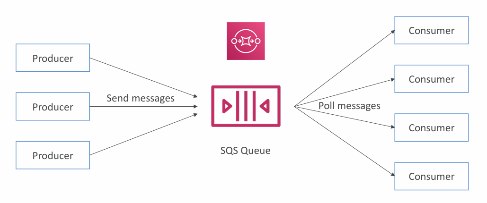
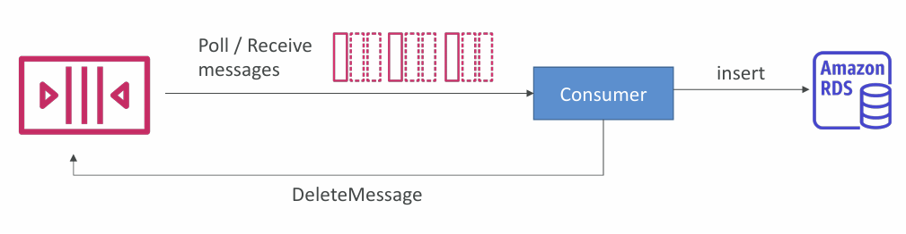
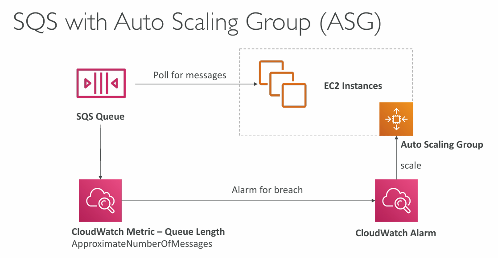
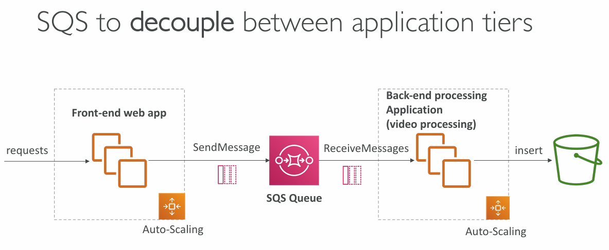
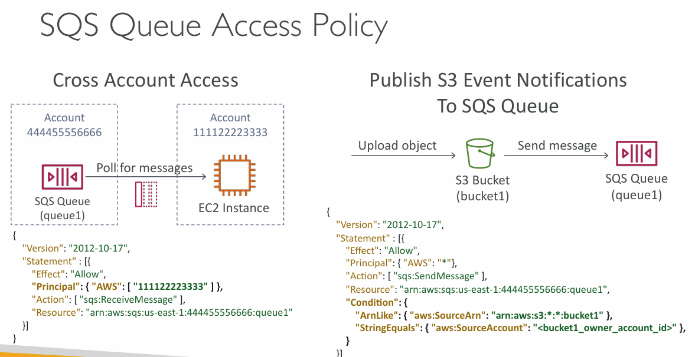
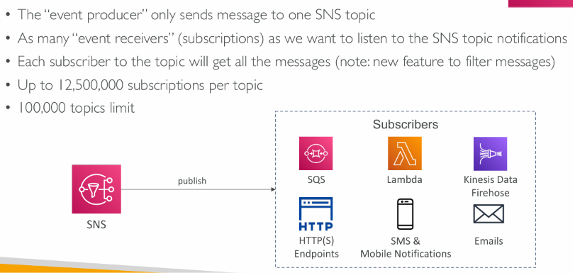
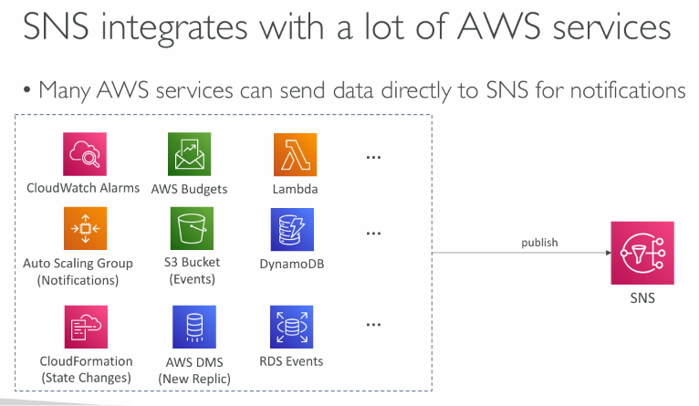

# Amazon SQS, SNS and kinesis

two patterns of application communication:

1.  Synchronous ( application to application )
    - can be problematic if there are sudden spikes of traffic

2.  Asynchronous / event based ( application to queue to queue )
    - that case, it’s better to decouple your applications
    - use SQS: queue model, SNS: pub/sub model, Kinesis: real-time streaming model
    - These services can scale independently from our application!

## SQS - simple queue service



1. Fully managed service, used to decouple application
2. Unlimited throughput, unlimited number of messages in queue
3. Default retention of messages: 4 days, maximum of 14 days
4. Low latency (<10 ms on publish and receive)
5. Limitation of 1,024 KB per message sent

### SQS – Producing Messages

1. Produced to SQS using the SDK (SendMessage API)
2. The message is persisted in SQS until a consumer deletes it

### SQS – Consuming Messages

1. Consumers (running on EC2 instances, servers, or AWS Lambda)
2. Poll SQS for messages (receive up to 10 messages at a time)
3. You can use Multiple EC2 Instances Consumers. Consumers receive and process messages in parallel

    




### Amazon SQS - Security

1. Encryption:
    - In-flight encryption using HTTPS API
    - At-rest encryption using KMS keys
    - Client-side encryption if the client wants to perform encryption/decryption itself

2. Access Controls: IAM policies to regulate access to the SQS API

3. SQS Access Policies
    - Useful for cross-account access to SQS queues
    - Useful for allowing other services (SNS, S3…) to write to an SQS queue

    

### Hands On

```txt
1. Create SQS
2. go to Access policy
3. Add policy to allow S3 to push messages to SQS
4. poll for messages
```

```json
{
    "Version": "2012-10-17",
    "Statement": [
        {
            "Effect": "Allow",
            "Principal": {
                "Service": "s3.amazonaws.com"
            },
            "Action": "SQS:SendMessage",
            "Resource": "arn:aws:sqs:<region>:<account_id>:DemoQueue",
            "Condition": {
                "StringEquals": {
                    "aws:SourceAccount": "<account_id>"
                },
                "ArnLike": {
                    "aws:SourceArn": "arn:aws:s3:*:*:sqs-demo-events-<account_id>-<region>"
                }
            }
        }
    ]
}
```

## SQS – Message Visibility Timeout

After a message is polled by a consumer, it becomes invisible to other consumers till defined visibility timeout period.

By default, the “message visibility timeout” is 30 seconds. That **means the message has 30 seconds to be processed, If not deleted by then, it becomes visible to other consumers again!**

If **message processing time is more than visibility timeout**, then the message will become visible again and other consumers can process it. That leads to duplicate processing of the same message.

To avoid duplicate processing, we **can call the ChangeMessageVisibility API to get more time**
Or we can use **Long Polling**.

## Amazon SQS – Dead Letter Queue (DLQ)

1. If a consumer fails to process a message within the Visibility Timeout… the message goes back to the queue!
2. We can set a threshold of how many times a message can go back to the queue
3. **After the MaximumReceives threshold is exceeded**, the message goes into a **Dead Letter Queue (DLQ)**
4. Useful for debugging
5. DLQ of a FIFO queue must also be a FIFO queue
6. DLQ of a Standard queue must also be a Standard queue

Hands on

```txt
1. Create SQS queue which you are gonna use for DLQ

2. Create main SQS queue
    a. enable DQL
    b. configure maximum receives = 3 (means after how many times it will go to DLQ)
    c. Choose queue(DLQ)
```

### SQS DLQ – Redrive to Source

Feature to help redrive the messages from the DLQ back into the source queue (or any other queue) in batches without writing custom code.

Means we can re-run the processing of messages (that were moved to DLQ) after fixing the issue in our application.

Hands on

```txt
1. Go to DLQ
2. Click on Redrive to source
3. Configure source queue (bydefault it will which is associate with DLQ) and number of messages to redrive (by default it will be all messages)
4. Poll for messages -> you can select which messages to redrive
5. Click on Redrive
```

## Amazon SQS - Long Polling

In Amazon SQS, **long polling is a mechanism that allows your application to wait for messages to arrive in a queue, rather than checking and returning immediately even if the queue is empty.**

This reduces the number of empty responses and is generally the recommended practice to improve efficiency and reduce costs.

use ReceiveMessageWaitTimeSeconds to enable long polling.

### SQS – Must know API

- CreateQueue (MessageRetentionPeriod), DeleteQueue
- PurgeQueue: delete all the messages in queue
- SendMessage (DelaySeconds), ReceiveMessage, DeleteMessage
- MaxNumberOfMessages: default 1, max 10 (for ReceiveMessage API)
- ReceiveMessageWaitTimeSeconds: Long Polling
- ChangeMessageVisibility: change the message timeout
- Batch APIs for SendMessage, DeleteMessage, ChangeMessageVisibility
  helps decrease your costs

## Amazon SQS – FIFO Queue

FIFO = First In First Out (ordering of messages in the queue)

1. Exactly-once send capability (by removing duplicates using Deduplication ID)
2. Messages are processed in order by the consumer
3. Ordering by Message Group ID

### SQS FIFO – Deduplication

1. De-duplication interval is 5 minutes
2. Two de-duplication methods:
   a. Content-based deduplication: will do a SHA-256 hash of the message body
   b. Explicitly provide a Message Deduplication ID

### SQS FIFO – Message Grouping

- If you specify the same value of MessageGroupID in an SQS FIFO queue, you can only have one consumer, and all the messages are in order
- To get ordering at the level of a subset of messages, specify different values for MessageGroupID
- Each Group ID can have a different consumer (parallel processing!)
- Ordering across groups is not guaranteed
- If you have **message deduplication Id and you send different message then first message will be send because other get duplicated because of same message deduplication Id**

Hands on

```txt
1. Create SQS queue - select FIFO
2. select deduplication method (content based or explicit)
```

# Amazon SNS (Simple Notification System )




### Amazon SNS – How to publish

1. Topic Publish (using the SDK)
    - Create a topic
    - Create a subscription (or many)
    - Publish to the topic
2. Direct Publish (for mobile apps SDK)
    - Create a platform application
    - Create a platform endpoint
    - Publish to the platform endpoint
    - Works with Google GCM, Apple APNS, Amazon ADM

### Amazon SNS – Security

- Encryption:
    - In-flight encryption using HTTPS API
    - At-rest encryption using KMS keys
    - Client-side encryption if the client wants to perform encryption/decryption itself
- Access Controls: IAM policies to regulate access to the SNS API
- SNS Access Policies (similar to S3 bucket policies)
    - Useful for cross-account access to SNS topics
    - Useful for allowing other services ( S3…) to write to an SNS topic

### SNS + SQS: Fan Out

1. Push once in SNS, receive in all SQS queues that are subscribers
2. Fully decoupled, no data loss
3. SQS allows for: data persistence, delayed processing and retries of work
4. Ability to add more SQS subscribers over time
5. Make sure your SQS queue access policy allows for SNS to write
6. Cross-Region Delivery: works with SQS Queues in other regions

### Amazon SNS – FIFO Topic

Similar features as SQS FIFO:

Subscribers SQS FIFO

1. Ordering by Message Group ID (all messages in the same group are ordered)
2. Deduplication using a Deduplication ID or Content Based Deduplication
3. Can have SQS Standard and FIFO queues as subscribers

### SNS – Message Filtering

1. JSON policy used to filter messages sent to SNS topic’s subscriptions
2. If a subscription doesn’t have a filter policy, it receives every message
3. Example:

```json
{
    "FilterPolicy": {
        "event": ["order", "payment"],
        "cost": [{ "numeric": ["<=", 100] }]
    }
}
```
