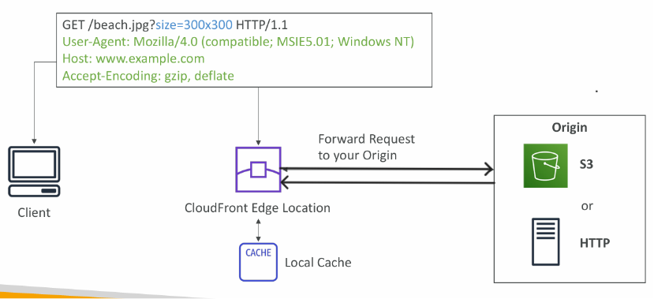
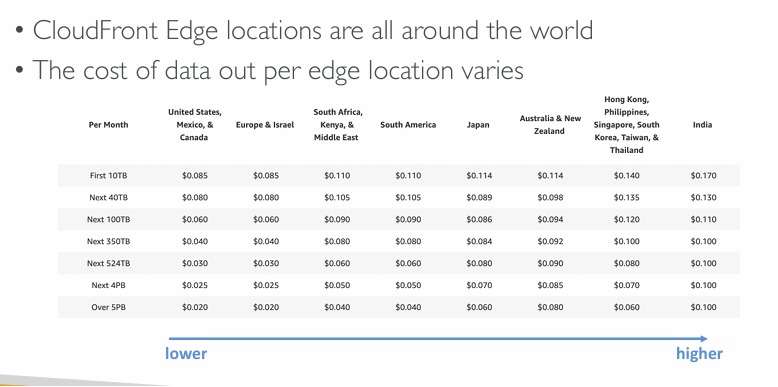

# AWS CloudFront

Content Delivery Network (CDN)

- Improves read performance, content is cached at the edge
- Improves users experience
- Hundreds of Points of Presence globally (edge locations, caches)
- DDoS protection (because worldwide), integration with Shield and AWS Web Application Firewall

### CloudFront – Origins

1. S3 bucket
    - For distributing files and caching them at the edge
    - For uploading files to S3 through CloudFront
    - Secured using Origin Access Control (OAC)

2. VPC Origin
    - For applications hosted in VPC private subnets
    - Private Application Load Balancer / Network Load Balancer / EC2 Instances

3. Custom Origin (HTTP)
    - S3 website (must first enable the bucket as a static S3 website)
    - Any public HTTP backend you want (example: Public ALB)



## CloudFront vs S3 Cross Region Replication

1. CloudFront:
    - Global Edge network
    - Files are cached for a TTL (maybe a day)
    - Great for static content that must be available everywhere
2. S3 Cross Region Replication:
    - Must be setup for each region you want replication to happen
    - Files are updated in near real-time
    - Great for dynamic content that needs to be available at low-latency in few regions

## Hands on - Cloudfront

```
1. Create a s3 bucket
3. Create a cloudfront distribution
    1.entre distribution options
        - enter the origin
        - Distribution type
    2. Origin type - s3, vpc, ELB, EC2, Custom HTTP Origin
    3. select s3 bucket
    4. Settings
    5. Security settings
    6. review and save
```

## CloudFront Caching

- The cache lives at each CloudFront Edge Location
- CloudFront identifies each object in the cache using the Cache Key
- You want to maximize the Cache Hit ratio to minimize requests to the origin
- You can invalidate par t of the cache using the CreateInvalidation API

## CloudFront Cache Key

A unique identifier for every object in the cache

- By default, consists of hostname + resource portion of the URL
- If you have an application that serves up content that varies based on user, device, language, location…
- You can add other elements (HTTP headers, cookies, query strings) to the Cache Key using CloudFront Cache Policies

## CloudFront Policies

- Cache based on:
    - HTTP Headers: None – Whitelist
    - Cookies: None – Whitelist – Include All-Except – All
    - Query Strings: None – Whitelist – Include All-Except – All
- Control the TTL (0 seconds to 1 year), can be set by the origin using the Cache-Control header, Expires header…
- Create your own policy or use Predefined Managed Policies

## CloudFront Origin Request Policies

Items in origin request policy are sent only to the origin, not included in cache key

- Specify values that you want to include in origin requests without including them in the Cache Key (no duplicated cached content)
- You can include:
    - HTTP headers: None – Whitelist – All viewer headers options
    - Cookies: None – Whitelist – All
    - Query Strings: None – Whitelist – All
- Ability to add CloudFront HTTP headers and Custom Headers to an origin request that were not included in the viewer request
- Create your own policy or use Predefined Managed Policies

## CloudFront Invalidation

- In case you update the back-end origin, CloudFront doesn’t know about it and will only get the refreshed content after the TTL has expired
  Eg.

```
GET /index.html
Invalidate- /index.html- /images/*
```

- However, you can force an entire or partial cache refresh (thus bypassing the TTL) by performing a CloudFront Invalidation
- You can invalidate all files (\*) or a special path (/images/\*)

## CloudFront – Cache Behaviors

- Configure different settings for a given URL path pattern
- Route to different kind of origins/origin groups based on the content type or path pattern
    - /images/\*
    - /api/\*
    - **/\* (default cache behavior)**
- When adding additional Cache Behaviors, the **Default Cache Behavior is always the last to be processed** and is always /\*

## Hands on

1. cache policy

    ```
    1. go to cloud front console
    2. click on behaviors
    3. create/edit behaviors
    4. edit cache policy
    ```

2. Origin Request policy

    ```
    1. go to cloud front console
    2. click on behaviors
    3. create/edit behaviors
    4. edit origin request policy
    ```

3. Cache Invalidation
    ```
    1. go to cloud front console
    2. click on invalidations
    3. click on create invalidation
        - Select Method - by path or by cache tags
        - Object paths to invalidation - Eg. /* or /images/*
    ```

## CloudFront Geo Restriction

- You can restrict who can access your distribution
    - Allowlist: Allow your users to access your content only if they're in one of the countries on a list of approved countries.
    - Blocklist: Prevent your users from accessing your content if they're in one of the countries on a list of banned countries.
- The “country” is determined using a 3rd party Geo-IP database
- Use case: Copyright Laws to control access to content

## CloudFront Signed URL / Signed Cookies

You want to distribute paid shared content to premium users over the world

- Signed URL = access to individual files (one signed URL per file)
- Signed Cookies = access to multiple files (one signed cookie for many files)

1. **CloudFront Signed URL**:

- Allow access to a path, no matter the origin
- Account wide key-pair, only the root can manage it
- Can filter by IP, path, date, expiration
- Can leverage caching features

2. **S3 Pre-Signed URL**:

- Issue a request as the person who pre-signed the URL
- Uses the IAM key of the signing IAM principal
- Limited lifetime

### CloudFront Signed URL Process

- Two types of signers:
    - Either a **trusted key group** (recommended)
        - Can leverage APIs to create and rotate keys (and IAM for API security)
    - An **AWS Account** that contains a CloudFront Key Pair
        - Need to manage keys using the root account and the AWS console
        - Not recommended because you shouldn’t use the root account for this
- In your CloudFront distribution, create one or more trusted key groups
- You generate your own public / private key
    - The private key is used by your applications (e.g. EC2) to sign URLs
    - The public key (uploaded) is used by CloudFront to verify URLs

### CloudFront - Pricing



## CloudFront – Multiple Origin

To route to different kind of origins based on the content type

Based on path pattern:

- /images/\*
- /api/\*
- /\*\*

## CloudFront – Origin Groups

To increase high-availability and do failover

- Origin Group: one primary and one secondary origin
- If the primary origin fails, the second one is used


## CloudFront – Field Level Encryption

1. Protect user sensitive information through application stack
2. Adds an additional layer of security along with HTTPS
3. Sensitive information encrypted at the edge close to user
4. Uses asymmetric encryption
5. Usage:
    - Specify set of fields in POST requests that you want to be encrypted (up to 10 fields)
    - Specify the public key to encrypt them

## CloudFront – Real-time Logs

- Get real-time requests received by CloudFront sent to Kinesis Data Streams
- Monitor, analyze, and take actions based on content delivery performance
- Allows you to choose:
    - Sampling Rate – percentage of requests for which you want to receive
    - Specific fields and specific Cache Behaviors (path patterns)
