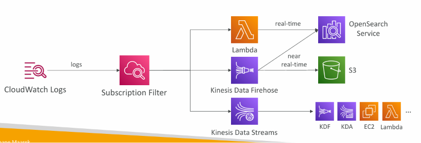
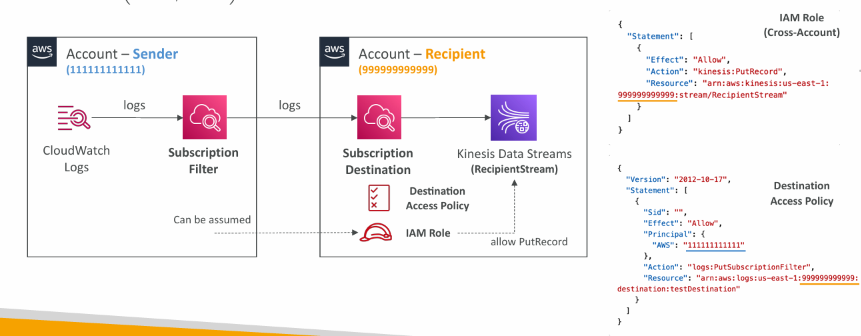
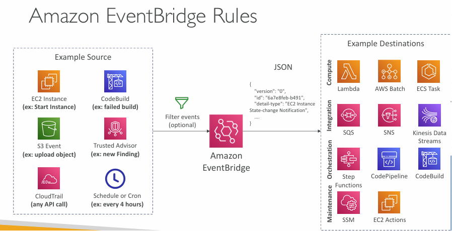
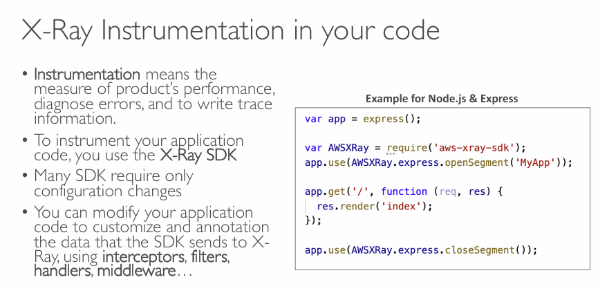

# AWS Monitoring and Audit

Monitoring in AWS

1. AWS CloudWatch:
    - Metrics: Collect and track key metrics
    - Logs: Collect, monitor, analyze and store log files
    - Events: Send notifications when certain events happen in your AWS
    - Alarms: React in real-time to metrics / events
2. AWS X-Ray:
    - Troubleshooting application performance and errors
    - Distributed tracing of microservices
3. AWS CloudTrail:
    - Internal monitoring of API calls being made
    - Audit changes to AWS Resources by your users

### Custom matrix in cloudwatch

Amazon CloudWatch custom metrics are application-specific data points that you define and send to CloudWatch to track business logic, user behavior, or operational details that default AWS monitoring cannot capture

Creating custom metrics from CLI:-

```bash
aws cloudwatch put-metric-data --metric-name Buffers --namespace MyNameSpace --unit Bytes --value 231434333 --dimensions InstanceId=1-23456789,InstanceType=m1.small
```

Example: Payment Success vs Failure ( Node.js )

```javascript
async function sendPaymentMetric(status) {
    await cloudwatch.send(
        new PutMetricDataCommand({
            Namespace: "Ecommerce/Payments",
            MetricData: [
                {
                    MetricName: "PaymentCount",
                    Value: 1,
                    Unit: "Count",
                    Dimensions: [
                        {
                            Name: "Status",
                            Value: status,
                        },
                    ],
                },
            ],
        }),
    );
}

// USAGE
try {
    await processPayment();

    await sendPaymentMetric("Success");
} catch (error) {
    await sendPaymentMetric("Failure");
}
```

## CloudWatch Logs

1. Log Events: A single, time-stamped record of activity, such as an application log line.
2. Log Streams: An ordered sequence of log events from a single source (e.g., a specific EC2 instance).
3. Log Groups: A container for log streams that share the same retention and access controls (e.g., all logs from a specific application).
4. CloudWatch Logs can send logs to: **Amazon S3 (exports), Kinesis Data Streams, Kinesis Data Firehose, AWS Lambda, OpenSearch**

### CloudWatch Logs - Sources

1. SDK, CloudWatch Logs Agent, CloudWatch Unified Agent
2. Elastic Beanstalk: collection of logs from application
3. ECS: collection from containers
4. AWS Lambda: collection from function logs
5. VPC Flow Logs: VPC specific logs
6. API Gateway
7. CloudTrail based on filter
8. Route53: Log DNS queries

### Real Example: ECS Container Logs

```javascript
// ECS Task Definition
{
  "logConfiguration": {
    "logDriver": "awslogs",
    "options": {
      "awslogs-group": "/ecs/user-service",
      "awslogs-region": "ap-south-1",
      "awslogs-stream-prefix": "ecs"
    }
  }
}

// Node.js:
console.log("User login successful");
console.error("Payment failed");
```

These logs automatically appear in CloudWatch.

### Key Features & Capabilities

| Feature                   | What it does                                                                                           | Benefit                                                                                                                                 |
| ------------------------- | ------------------------------------------------------------------------------------------------------ | --------------------------------------------------------------------------------------------------------------------------------------- |
| CloudWatch Logs Insights  | Interactive, purpose-built query engine for analyzing logs.                                            | Quickly troubleshoot issues by searching for specific patterns or error codes across massive log volumes.                               |
| Metric Filters            | Scans logs for specific terms (e.g., "NullReferenceException") and turns them into CloudWatch metrics. | Create alarms to be notified when the rate of errors exceeds a threshold, without code changes.                                         |
| Live Tail                 | Streams new log events in near real-time with filtering capabilities.                                  | Debug live incidents and instantly see the impact of a new deployment or fix.                                                           |
| Log Classes               | Two storage tiers: Standard (full features) and Infrequent Access (lower cost, subset of features).    | Optimize costs for logs based on access frequency; keep operational logs in Standard and archive rarely-used logs in Infrequent Access. |
| Sensitive Data Protection | Audits and masks sensitive data (e.g., PII, passwords) in log events.                                  | Helps meet compliance requirements and prevents accidental exposure of critical data.                                                   |
| Export to S3              | Archive log data to Amazon S3 for long-term storage or use with other analytics tools.                 | Durable, low-cost storage for logs that must be retained for years.                                                                     |

## CloudWatch Logs subscription

1. Get a real-time log events from CloudWatch Logs for processing and analysis
2. Send to Kinesis Data Streams, Kinesis Data Firehose, or Lambda
3. Subscription Filter – filter which logs are events delivered to your destination

    

### Cross-Account Subscription – send log events to resources in a different AWS account (KDS, KDF)



## Cloudwatch Metric

Scans logs for specific terms (e.g., "NullReferenceException") and turns them into CloudWatch metrics.

Hands on:

```
1. go to cloudwatch console -> Log Management
2. click on Log groups -> select log group
3. Create metric filter
4. filter pattern Eg. Error -> test on existing logs
5. Enter filter name, Metric Namespace, Metric name, Metric value
6. Create

7. click on your Metric from metric filter -> You will see your custom metric
8. If you want you can create alarm on that metric

```

## Cloudwatch Live-trail

Streams new log events in near real-time with filtering capabilities.

Hands on

```
1. Go to CloudWatch Log Groups -> click your log group
2. click on button: Live Tail (right top corner)
3. You will see live stream of logs
4. You can also filter logs

5. from Log stream -> create log stream ( You will see your log in Live-Trail UI)
```

## CloudWatch Logging for EC2

To send logs from your EC2 instances to CloudWatch Logs, you need to install and configure the CloudWatch Agent on each instance

```
Step 1: Set Up IAM Permissions: Required Policy: The AWS-managed CloudWatchAgentServerPolicy provides the core permissions needed to create log groups, streams, and put log events

Step 2: Install the CloudWatch Agent
sudo yum install amazon-cloudwatch-agent

Step 3: Configure the Agent
You must create a JSON configuration file that tells the agent which log files to collect and where to send them.

sudo /opt/aws/amazon-cloudwatch-agent/bin/amazon-cloudwatch-agent-config-wizard

{
  "logs": {
    "logs_collected": {
      "files": {
        "collect_list": [
          {
            "file_path": "/var/log/test-app.log",
            "log_group_name": "/aws/ec2/test-app",
            "log_stream_name": "{instance_id}"
          }
        ]
      }
    }
  }
}

Step 4: Start and Enable the Agent
sudo /opt/aws/amazon-cloudwatch-agent/bin/amazon-cloudwatch-agent-ctl -a fetch-config -m ec2 -s -c file:/opt/aws/amazon-cloudwatch-agent/bin/config.json

To ensure the agent automatically restarts if the instance reboots, enable it as a service:
sudo systemctl enable amazon-cloudwatch-agent

```

### Common Use Cases

Application Debugging: Instead of logging to a file on the instance and losing it when the instance terminates, you can stream application logs (e.g., from Node.js, Nginx, or a custom Java app) directly to CloudWatch, allowing you to debug issues even after the instance is gone

## CloudWatch Alarms

1. Composite Alarms:
    - Cloudwatch alarms are on single metric.
    - Composite alarms are monitoring the states of multiple other alarms.
    - AND and OR conditions.

Hands on Simple Alarm:\
Eg. Alarm to handle EC2 Instance State - Terminate instance on CPU utilization above 95%

```
1. Create EC2 instance.
2. GO to Cloudwatch Alarms
3. Create Alarm -> select metrics ( Eg. EC2, EBS, SNS, Lambda Etc.)
4. Add Conditions
5. configure Alarm state trigger
6. Select action
```

## CloudWatch Synthetics Canary

1. Configurable script that monitor your APIs, URLs, Websites, …
2. Reproduce what your customers do Users us-east-1 programmatically to find issues before customers are impacted
3. Checks the availability and latency of your endpoints and can store load time data and screenshots of the UI Route 53 update DNS record monitor
4. Integration with CloudWatch Alarms
5. Scripts written in Node.js or Python invoke trigger
6. Can run once or on a regular schedule

## Amazon EventBridge (formerly Cloudwatch Events)

1. Schedule: Cron jobs (scheduled scripts)
2. Event Pattern: Event rules to react to a service doing something ( Eg. IAM Root User Sign in Event, EC2 state change)
3. Trigger Lambda functions, send SQS/SNS messages…
4. Event buses can be accessed by other AWS accounts using resource-based Policies
5. You can archive events (all/filter) sent to an event bus (indefinitely or set period)
6. Ability to replay archived events
   

### EventBridge - Schema Registry

- EventBridge can analyze the events in your bus and infer the schema
- The Schema Registry allows you to generate code for your application, that will know in advance how data is structured in the event bus

### Amazon EventBridge – Resource-based Policy

- Manage permissions for a specific Event Bus
- Example: allow/deny events from another AWS account or AWS region
- Use case: aggregate all events from your AWS Organization in a single AWS account or AWS region

Hands on:

```
1. Go to Amazon EventBridge -> Create rule
2. Select Events matching pattern
3. Select Target
```

## Amazon X-ray

Amazon X-Ray is a service that helps you trace and analyze requests as they travel through your application, providing an end-to-end view of performance and interactions across all components.

### Core Concepts and How It Works

X-Ray's core function is built on a few key concepts that work together to give you a complete picture of your application.

| Concept     | Description                                                                                                                               |
| ----------- | ----------------------------------------------------------------------------------------------------------------------------------------- |
| Trace       | A complete path of a single request as it flows through all the different components of your application.                                 |
| Segment     | Data recorded by a single component (like a Lambda function) about its part in processing a request.                                      |
| Subsegment  | A more granular piece of a segment, often representing a downstream call to an AWS service like DynamoDB, an external API, or a database. |
| Service Map | A visual graph showing all your application's services, their connections, and health metrics like error rates and latency.               |

**The typical process is:**

1. **Instrumentation**: You integrate the X-Ray SDK into your application code or enable it for services like Lambda.
2. **Data Collection**: The instrumented application sends trace data to a local agent (like the X-Ray daemon on EC2 or the ADOT Collector), which batches and forwards it to X-Ray.
3. **Visualization & Analysis**: X-Ray processes the data and presents it through a trace map and service map in the console, which you can filter and analyze to find issues.



**Topics to learn**

1. X-Ray Sampling Rules
2. X-Ray Write APIs (used by the X-Ray daemon)
3. X-Ray daemon
4. X-Ray with Elastic Beanstalk
5. Aws Opentelemetry

## AWS CloudTrail

1. Provides governance, compliance and audit for your AWS Account
2. Get an history of events / API calls made within your AWS Account by:
    - Console
    - SDK
    - CLI
    - AWS Services
3. Can put logs from CloudTrail into CloudWatch Logs or S3
4. If a resource is deleted in AWS, investigate CloudTrail first!

### CloudTrail Events

#### 1. Management Events

- Operations that are performed on resources in your AWS account
- Examples:
    - Configuring security (IAM AttachRolePolicy)
    - Configuring rules for routing data (Amazon EC2 CreateSubnet)
    - Setting up logging (AWS CloudTrail CreateTrail)
- By default, trails are configured to log management events.
- Can separate Read Events (that don’t modify resources) from Write Events (that may modify resources)

#### 2. Data Events

- By default, data events are not logged (because high volume operations)
- Amazon S3 object-level activity (ex: GetObject, DeleteObject, PutObject): can separate Read and Write Events
- AWS Lambda function execution activity (the Invoke API)

#### 3. CloudTrail Insights Events

Enable CloudTrail Insights to detect unusual activity in your account:

- inaccurate resource provisioning
- hitting service limits
- Bursts of AWS IAM actions
- Gaps in periodic maintenance activity

### CloudTrail Events Retention

Events are stored for 90 days in CloudTrail, To keep events beyond this period, log them to S3 and use Athena

## CloudTrail vs CloudWatch vs X-Ray

- CloudTrail:
    - Audit API calls made by users / services / AWS console
    - Useful to detect unauthorized calls or root cause of changes
- CloudWatch:
    - CloudWatch Metrics over time for monitoring
    - CloudWatch Logs for storing application log
    - CloudWatch Alarms to send notifications in case of unexpected metrics
- X-Ray:
    - Automated Trace Analysis & Central Service Map Visualization
    - Latency, Errors and Fault analysis
    - Request tracking across distributed systems
