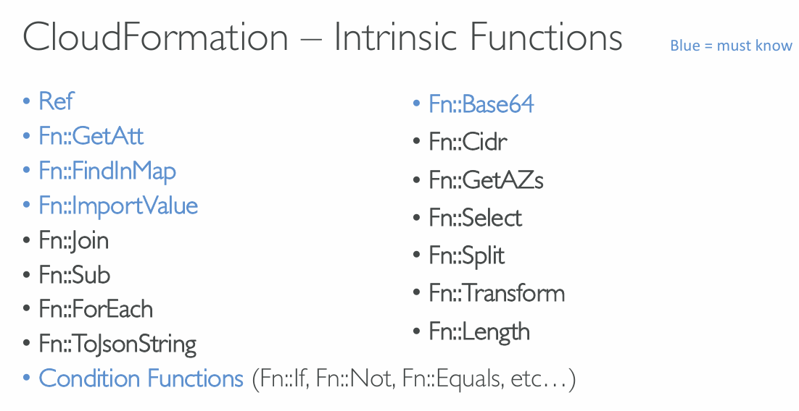

# AWS CloudFormation

AWS CloudFormation is an Infrastructure as Code (IaC) service that **allows you to model, provision, and manage AWS resources using declarative template files (JSON or YAML)**

### Benefits of AWS CloudFormation

- No resources are manually created, which is excellent for control
- Changes to the infrastructure are reviewed through code
- You can estimate the costs of your resources using the CloudFormation template
- Savings strategy: In Dev, you could automation deletion of templates at 5 PM and recreated at 8 AM, safely
- Separation of concern: create many stacks for many apps, and many layers. Ex VPC stacks, App stacks

### How CloudFormation works

- Templates must be uploaded in S3 and then referenced in CloudFormation
- To update a template, we can’t edit previous ones. We have to reupload a new version of the template to AWS
- Stacks are identified by a name
- Deleting a stack deletes every single artifact that was created by CloudFormation.

### How to deploy CloudFormation templates

- Manual way
    - Editing templates in Infrastructure Composer or code editor
    - Using the console to input parameters, etc…
    - We’ll mostly do this way in the course for learning purposes
- Automated way
    - Editing templates in a YAML file
    - Using the AWS CLI (Command Line Interface) to deploy the templates, or using a Continuous Delivery (CD) tool
    - Recommended way when you fully want to automate your flow

### Template’s Components

- AWSTemplateFormatVersion – identifies the capabilities of the template “2010-09-09”
- Description – comments about the template
- Resources (MANDATORY) – your AWS resources declared in the template
- Parameters – the dynamic inputs for your template
- Mappings – the static variables for your template
- Outputs – references to what has been created
- Conditionals – list of conditions to perform resource creation
- References
- Functions

### CloudFormation - Resource

- Resources are the core of your CloudFormation template (MANDATORY)
- They represent the different AWS Components that will be created and
  configured
- Resources are declared and can reference each other

### CloudFormation – Parameters

Parameters are a way to provide inputs to your AWS CloudFormation template

1. Parameters can be controlled by
    - Type: String, Number, CommaDelimitedList, List<Number>,
    - SSM Parameter (get parameter
2. value from SSM Parameter store)
    - Description
    - ConstraintDescription (String)
    - Min/MaxLength
    - Min/MaxValue
    - Default
    - AllowedValues (array)
    - AllowedPattern (regex)
    - NoEcho (Boolean)

**How to Reference a Parameter?**

You use the Intrinsic Function !Ref to reference a resource or parameter in CloudFormation

```YAML
!Ref LogicalResourceName
!Ref LogicalParameterName
```

**Pseudo Parameter**
These can be used at any time and are enabled by default

| Reference Value                                                    | ExampleReturned Value                                                                           |
| ------------------------------------------------------------------ | ----------------------------------------------------------------------------------------------- |
| AWS::AccountId                                                     | 123456789012                                                                                    |
| AWS::Region                                                        | us-east-1                                                                                       |
| AWS::StackId                                                       | arn:aws:cloudformation:us-east-1:123456789012:stack/MyStack/1c2fa620-982a11e3-aff7-50e2416294e0 |
| AWS::StackName                                                     | MyStack                                                                                         |
| AWS::NotificationARNs [arn:aws:sns:us-east-1:123456789012:MyTopic] | AWS::NoValue Doesn’t return a value                                                             |

### CloudFormation - Mapping

Mappings are fixed variables within your CloudFormation template. All the values are hardcoded within the template

```YAML
Mappings:
  RegionToInstanceType:
    us-east-1:
      InstanceType: t2.micro
    eu-north-1:
      InstanceType: t3.micro
```

**How to reference a Mapping?**

We use Fn::FindInMap to return a named value from a specific key

```YAML
!FindInMap [ MapName, TopLevelKey, SecondLevelKey ]

EG.
Resources:
  MyEC2Instance:
    Type: AWS::EC2::Instance
    Properties:
      ImageId: !FindMap [RegionToInstanceType, !Ref "AWS::Region", InstanceType]
```

### When would you use Mappings vs. Parameters

Mappings are great when you know in advance all the values that can be
taken and that they can be deduced from variables such as

- Region
- Availability Zone
- AWS Account
- Environment (dev vs prod)
- etc

### CloudFormation - Outputs

Outputs section declares optional outputs values that we can import into other stacks. It’s the best way to perform some collaboration cross
stack.

Eg. a network CloudFormation stack, and then you output the VPC IDs and the Subnet IDs and reuse them other ways.

```YAML
Outputs:
  StackSSHSecurityGroup:
    Description: The SSH Security Group for our Company
    Value: !Ref MyCompanyWideSSHSecurityGroup
    Export:
        Name: SSHSecurityGroup
```

### CloudFormation – Outputs Cross-Stack Reference

We then create a second template that leverages that security group. For this, we use the Fn::ImportValue function. And you can’t delete the underlying stack until all the references are deleted

```YAML
Resources:
    MyInstance:
        Type: AWS::EC2::Instance
        Properties:
            InstanceType: t3.micro
            SecurityGroups:
                - !ImportValue SSHSecurityGroup
```

### CloudFormation – Conditions

1. Conditions are used to control the creation of resources or outputs based on a condition
2. Each condition can reference another condition, parameter value or mapping
3. The intrinsic function (logical) can be any of the - Fn::And, Fn::Equals, Fn::If, Fn::Not, Fn::Or

```YAML

# Creation
Conditions:
    CreateProdResources: !Equals [!Ref EnvType, prod]

# Using
Resources:
    MountPoint:
        Type: AWS::EC2::VolumeAttachment
        Condition: CreateProdResources
```

### Cloudfront Intrinsic Functions



### CloudFormation – Rollbacks

- Stack Creation Fails: Default: everything rolls back (gets deleted). We can look at the log
- Stack Update Fails: The stack automatically rolls back to the previous known working state

### CloudFormation – Service Role

IAM role that allows CloudFormation to
create/update/delete stack resources on your
behalf

- Give ability to users to create/update/delete the
  stack resources even if they don’t have
  permissions to work with the resources in the
  stack
- User must have iam:PassRole permissions

```
Hands On:
1. Create role with AWS service -> CloudFront
2. Add permissions for services you want to access
3. Attach to a CloudFormation stack -> permissions
```

### Cloudfront Capabilities:

"Capabilities" in CloudFormation is a set of explicit acknowledgements you must provide to deploy certain types of resources.
Eg. IAM User, Role, Group, Policy, Access Keys, Instance Profile

```yml
Resources:
    MyCustomNamedRole:
        Type: AWS::IAM::Role

# This needs acknowledgement, so we have to add capability at the bottom
# Or while creating from console we have to check the acknowledge checkbox
Capabilities:
    - CAPABILITY_NAMED_IAM
```

### CloudFormation – DeletionPolicy Delete

DeletionPolicy: Control what happens when the CloudFormation template is deleted or when a resource is removed from a CloudFormation template

`Default DeletionPolicy = Delete`

`DeletionPolicy = Retain`: Specify on resources to preserve in case of CloudFormation deletes

```yml
Resources:
    MyInstance:
        Type: AWS::EC2::Instance
        #Default is Delete (It deletes the EC2 Instance)
        DeletionPolicy: Retain # This will not delete the EC2 instance on stack deletion
```

`DeletionPolicy = Snapshot`: Creates a final snapshot of the resource before deleting it.

```yml
Resources:
    MyVolume:
        Type: AWS::EC2::Volume
        DeletionPolicy: Snapshot
```

### CloudFormation – Termination Protection

To prevent accidental deletes of CloudFormation Stacks, use TerminationProtection.

Stack -> stack actions -> Edit Termination Protection -> Enable

### Cloudfront - Custom Resource

- Defined in the template using AWS::CloudFormation::CustomResource
  or Custom::MyCustomResourceTypeName (recommended)
- Backed by a Lambda function (most common) or an SNS topic
- have custom scripts run during create / update / delete through Lambda
  functions (Eg. running a Lambda function to empty an S3 bucket before being deleted)
- ServiceToken specifies where CloudFormation sends requests to, such as
  Lambda ARN or SNS ARN (required & must be in the same region)

```yml
Resources:
    MyCustomResource:
        Type: Custom:MyLambdaResource
        Properties:
            ServiceToken: arn:aws:lambda:us-east-1:123456789012:function:my-function
            MyParameter: MyValue
```

### Cloudfront - StackSet

Create, update, or delete stacks across multiple accounts and regions with a single operation/template

- Target accounts to create, update, delete stack instances from StackSets
- When you update a stack set, all associated stack instances are updated throughout all accounts and regions
- Can be applied into all accounts of an AWS Organization
- Only Administrator account (or Delegated Administrator) can create StackSets
