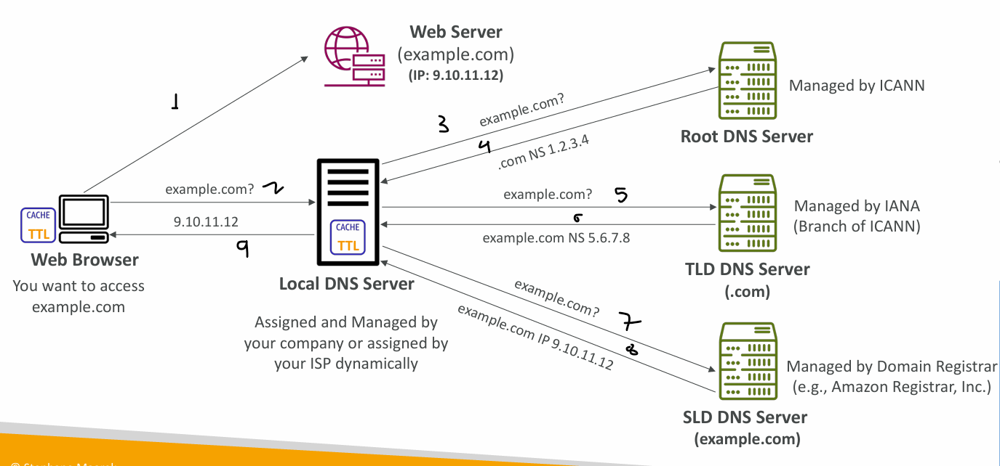
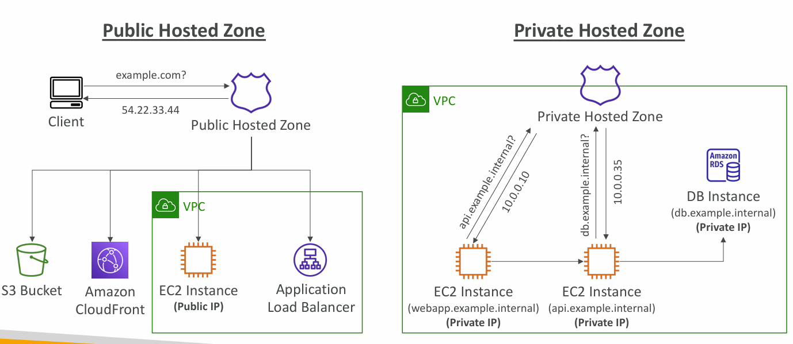

# Amazon Route 53

- Domain Name System which translates the human friendly hostnames into the machine IP addresses ( www.google.com => 172.217.18.36 )
- It also use to register and manage domain names

### DNS Terminology

- Domain Registrar: Amazon Route 53, GoDaddy, …
- DNS Records: A, AAAA, CNAME, NS, …
- Zone File: contains DNS records
- Name Server: resolves DNS queries (Authoritative or Non-Authoritative)
- Top Level Domain (TLD): .com, .us, .in, .gov, .org, …
- Second Level Domain (SLD): amazon.com, google.com, …
  

### How DNS works



## Route 53 - Record types

1. **A** - Maps **hostname** to **IPv4**
2. **AAAA** - Maps **hostname** to **IPv6**
3. **CNAME** - maps a **\*hostname** to another **hostname\***
    - The target is a domain name which must have an A or AAAA record
    - **Can’t create a CNAME record for the top node of a DNS namespace** (Zone Apex)
    - Example: you _can’t create for example.com_, but _you can create for_ www.example.com
4. **NS** - Name server for hosted zone
    - Control how traffic is routed for domain

### Hosted Zones :- This is not Free service($.50 per month per HZ)

- A container for records that define how to route traffic to a domain and its subdomains
- **Public Hosted Zones**:- contains records that specify how to route traffic on the Internet (public domain names)
- **Private Hosted Zones** – contain records that specify how you route
  traffic within one or more VPCs (private domain names) application1.company.internal



### Create Record hands on

```txt
example.com is your registered domain name, and it is hosted in Route 53

1. go to hosted zones
2. click on create record
3. enter record name - webserver(It will form as webserver.example.com)
4. select record type (A or AAAA or CNAME or NS)
5. enter value(IP address of server or domain name of other service)
6. Routing Policy (Simple, Failover, Latency, Geolocation, Multivalue, Weighted)
7. click on create records
```

### Route 53 - TTL(Time to Live)

- It is the time in seconds for which the DNS record is cached by the resolver
- Higher TTL = Less DNS queries, slower propagation
- Lower TTL = More DNS queries, faster propagation

Example :-

1. User requested `www.example.com` with ip assigned `1.1.1.1` and TTL is 120s
2. DNS resolver will check its cache first
3. user will get ip `1.1.1.1` from dns resolver
4. we changes route 53 record to assign new ip `2.2.2.2` within TTL period
5. User requested `www.example.com` again within 120s, then resolver will respond to client from its cache (still old ip `1.1.1.1`)
6. User requested `www.example.com` after 120s, then resolver will forward the request to authoritative name server (Route 53) again and get new ip `2.2.2.2` and stores the record in cache for 120s and then responds to client

## CNAME vs Alias

AWS Resources (Load Balancer, CloudFront...) expose an AWS hostname: lb1-1234.us-east-2.elb.amazonaws.com and you want myapp.mydomain.com

While both CNAME and ALIAS records can map one domain name to another

## 1. CNAME

- points to Any domain name (e.g., any-domain.com)
- Charged (standard query price)

## 2. Alias

- points to AWS resources (e.g., Load Balancer, CloudFront...)
- Free
- Automatically recognizes changes in the **resource’s IP addresses**
- Alias Record is **always of type A/AAAA** for **AWS resources** (IPv4 / IPv6)
- Record Targets:-
    - Elastic Load Balancing
    - CloudFront distributions
    - API Gateway
    - AWS Global Accelerator
    - S3 buckets that you’ve configured for static website hosting
    - _**You can not set alias to EC2 dns name**_

### IMP - Zone Apex: The Most Critical Difference

The most common point of confusion is the "Zone Apex" limitation. The Zone Apex (or "naked domain") is the root of your domain, like example.com (without the www.) == **domain name which you register in route 53**

**The Problem with CNAME:** According to DNS standards (RFC), you cannot create a CNAME record for the zone apex (example.com)

**The ALIAS Solution:** ALIAS records were created specifically to solve this problem. They **_allow you to point your naked domain (example.com) to AWS resources like S3 buckets or load balancers_**

## Routing Policies:

defines how the DNS queries are answered by the Route 53 DNS servers

1. **Routing policy - Simple**

- The most basic DNS routing policy that maps a domain name to a single resource or multiple IP addresses without any special logic
- If you specify multiple IP addresses in one record, Route 53 returns all values to the client in random order, and the client (browser) chooses which one to use

2. **Routing policy - Weighted**

- Control the % of the requests that go to each
  specific resource
- Assign each record a relative weight:
- traffic (%) = (weight / sum of all weights) × 100
- Weights don’t need to sum up to 100
- DNS records must have the same name and type
- Can be associated with Health Checks
- Use cases: load balancing between regions, testing new application versions…
- Assign a weight of 0 to a record to stop sending traffic to a resource

Hands on :-

- create two records with same record name eg. weighted.example.com in route 53 and select policy as weighted
- enter ip of first server in value of first record and enter weight 20
- enter ip of second server in value of second record and enter weight 80
- test the weighted routing (it will send 20% traffic to first server and 80% traffic to second server on every request)

3. **Routing policy - Latency based**:
   A policy that routes traffic to the AWS region that provides the lowest latency (fastest response time)

- How it works
    - You have resources deployed in multiple AWS regions (e.g., us-east-1, eu-west-1, ap-southeast-2)
    - You create latency records for each region
    - When a DNS query arrives, Route 53 uses its internal latency database to determine which region is closest to the user's source IP address

4. **Route 53 – Health Checks** -
    - HTTP Health Checks are only for public resources
    - Health Check => _**Automated DNS Failover**_:
    1. **Monitor an Endpoint**
        - Health checks that monitor an endpoint (application, server, other AWS resource)
        - About 15 global health checkers will check the endpoint health
        - If > 18% of health checkers report the endpoint is healthy, Route 53 considers it Healthy. Otherwise, it’s Unhealthy
        - Health Checks pass only when the endpoint responds with the 2xx and 3xx status codes
    2. **Calculated Health Checks** -
        - Combine the results of multiple Health Checks into a single Health Check
        - You can use OR, AND, or NOT
        - Can monitor up to 256 Child Health Checks
        - Specify how many of the health checks need to pass to make the parent pass

5. **Routing policy - Failover:**

- Route traffic based on the health status of resources
- Must use with health checks
- _hands on_: Create two records for failover with same record name primary and secondary and attach health checks to both records

6. **Routing policy - Geo-location**

- This routing is based on user location
- Specify location by Continent, Country or by US State (if there’s overlapping, most precise location selected)
- Should create a “Default” record (in case there’s no match on location)

7. **Routing policy - Geo-proximity**

- A routing policy that **directs traffic based on the actual geographic distance between your users and your resources (not just country boundaries)**
- Bias values:
    - To expand (1 to 99) – more traffic to the resource
    - To shrink (-1 to -99) – less traffic to the resource

8. **Routing policy - IP-based**

- Routing is based on clients’ IP addresses
- You provide a list of CIDRs for your clients and the corresponding endpoints/locations (user-IP-to-endpoint mappings)

9. **Routing policy - Multivalue answer**

- Lets you route traffic to multiple resources and **returns up to 8 healthy resource IPs** per query
- You can associate health checks with each resource
- If a resource is unhealthy, Route 53 automatically stops returning its IP address in query responses

### IMP Note:- Domain register !== DNS service

- If you buy your domain on a 3rd party registrar, you can still use Route 53
  as the DNS Service provider
- Create a Hosted Zone in Route 53 -> You will get 4 NS records
- Update NS Records on 3rd party website to use Route 53 Name Servers
