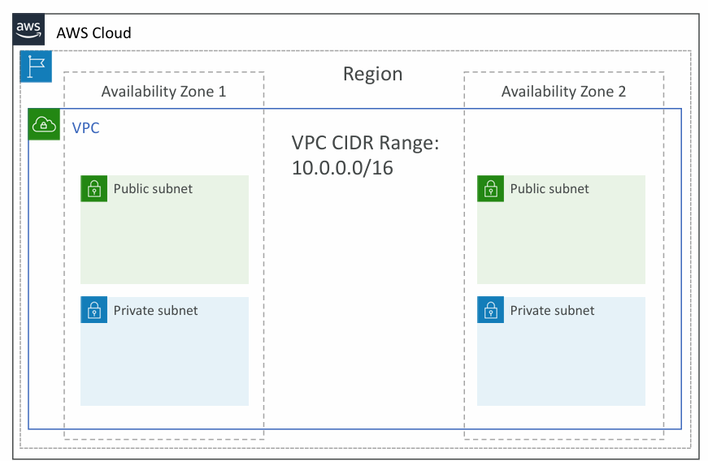
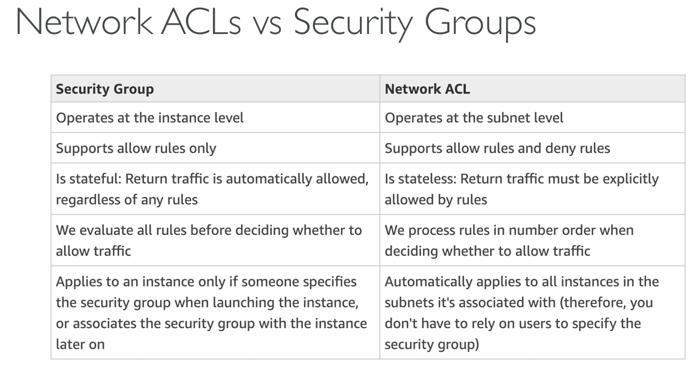
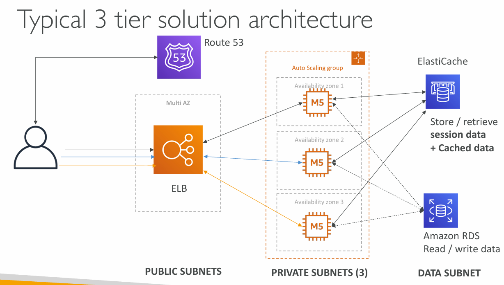

# VPC Fundamentals

### What is a VPC?

- VPC: private network to deploy your resources (Eg. EC2, RDS)
- Subnets allow you to partition your network inside your VPC (AZ level)
- A **public subnet** is a subnet that is accessible from the internet
- A **private subnet** is a subnet that is not accessible from the internet

## VPC Diagram

- CIDR Range - defines how many IPs are available in your VPC (10.0.0.0/16 = 65,536 IPs)
- When you use Cloud in AWS you have only one public subnet per AZ (default)

1. ### Internet Gateway
    - Allows communication between resources in your VPC and the internet
    - Helps our VPC instances connect with the internet
    - Public Subnets have a route to the internet gateway

2. ### NAT Gateway
    - AWS-managed NAT Gateway & NAT Instances **allow your instances in your Private Subnets to access the internet while remaining private** ( **not allowed access from internet** )

    How NAT Gateway works:
    1. Deploy a NAT gateway or in that instance, in our public subnets
    2. Create route from private subnet to NAT Gateway
    3. NAT has route to the internet gateway

    

3. ### Network ACL

- A firewall which controls traffic from and to subnet
- Can have ALLOW and DENY rules
- Are attached at the Subnet level
- Rules only include IP addresses

4. ### VPC Flow Logs

- Capture information about IP traffic going into your interfaces
- VPC Flow Logs
- Subnet Flow Logs
- Elastic Network Interface Flow Logs
- Captures network information from AWS managed interfaces too: Elastic Load
  Balancers, ElastiCache, RDS, Aurora, etc…
- VPC Flow logs data can go to S3, CloudWatch Logs, and Kinesis Data Firehose

5. ### VPC Peering

- Connect two VPC, privately using AWS’ network
- Must not have overlapping CIDR (IP address range) - if overlapping then not able to know which VPC to send the traffic to
- VPC Peering connection is not transitive (must be established for each VPC that need to communicate with one another) Eg. **A <-> B, B <-> C => A <-> C is not automatically established**

6. ### VPC Endpoints Private Access to AWS Services

    VPC Endpoints allow you to **connect to AWS services** (like S3, DynamoDB, CloudWatch) without using an **Internet Gateway, NAT device, or VPN** .

7. ### Site-To-Site VPN and Direct Connect

    A **site-to-site VPN** connection allows you to securely connect your on-premises data center or office network to your VPC over the public internet.

    **AWS Direct Connect** is a **private connection** between your on-premises data center and AWS.

